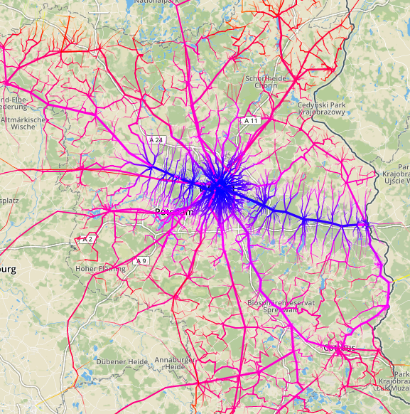

# Public Transport RoadsTo

This tool calculates all the possible public transport connections between certain location (*the Rome*) and everywhere else.

[](https://highsource.github.io/roads-to/Mindbox/index.html)

This solution is inpired by the [Roads To Rome](http://roadstorome.moovellab.com) by [moovellab](https://lab.moovel.com),
the only difference that it works with public transport connections (defined by a [GTFS](https://developers.google.com/transit/gtfs/reference/) timetable) and not a road network.


RoadsTo uses [public transport routing capabilities](https://github.com/graphhopper/graphhopper/tree/pt) of the ingenious [open-source routing library GraphHopper](https://graphhopper.com)
to build [shortest-path tree](https://en.wikipedia.org/wiki/Shortest-path_tree) from or to specified location and exports its as [GeoJSON](http://geojson.org) which allows easy visualizations.

RoadsTo was developed on the [5th DB Hackathon](https://www.mindboxberlin.com/index.php/db-hackathon-nr-5.html). Be aware that it is a quick over-the-night hack with no extensive testing.

# Usage

You will need a [GTFS](https://developers.google.com/transit/gtfs/reference/) timetable for calculations. Visit http://opentransportdata.de for some GTFS sources.

Download a current version of `roads-to.jar` from [Releases](https://github.com/highsource/roads-to/releases).

Example of command-line usage:


```
java
    -Xmx1G -XX:+UseConcMarkSweepGC
    -jar roads-to.jar
        -graph.location=data/swu
        -gtfs.file=files/swu.zip
        -fromlon=9.984123929980187
        -fromlat=48.399368824050626
        -geojson.file=roads.js
        -geojson.var=roads
```

Or, as a single line:

```
java -Xmx1G -XX:+UseConcMarkSweepGC -jar roads-to.jar -graph.location=swu -gtfs.file=swu.zip -fromlon=9.984123929980187 -fromlat=48.399368824050626 -geojson.file=roads.js -geojson.var=roads

```

Command-line options:

* `-gtfs.file=<GTFS file>` - provides GTFS file, required.
* `-graph.location=<graph directory>` - specifies the graph data directory, required.
* `-fromlon=<lon>` - longitude of the *Rome*, required.
* `-fromlat=<lat>` - latitude of the *Rome*, required.
* `-geojson.file=<GeoJSONB file>` - GeoJSON file to generate, optional. If omitted, output will be generated to stdout.
* `-geojson.var=<variable name>` - name of the variable to assign GeoJSON to, optional. If provided, RoadsTo will wrap GeoJSON in `var myVariable = <GeoJSON>;`.


Graph data only needs to be prepared once. In case of large timetables it may need a lot of memory, so `-Xmx16G -Xms1G` is recommended.
Other recommended GC settings are `-XX:+UseConcMarkSweepGC` and if you want to monitor garbage collection with `-XX:+PrintGCDetails -XX:+PrintGCTimeStamps`.

# Examples

* [Roads to Mindbox, Berlin](https://highsource.github.io/roads-to/Mindbox/index.html)
* [Roads to Ulm](https://highsource.github.io/roads-to/Ulm/index.html)
* [Roads to Palermo](https://highsource.github.io/roads-to/Palermo/index.html)

# License

[APL 2.0](LICENSE)